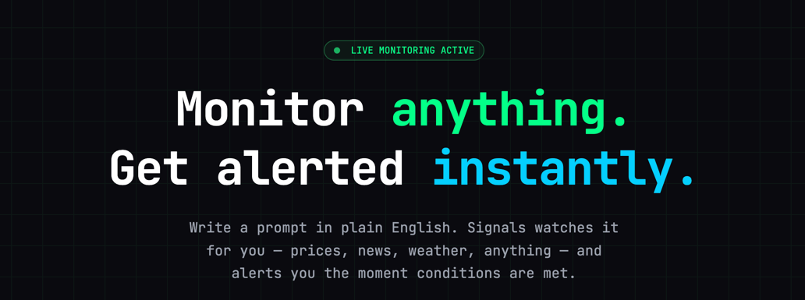
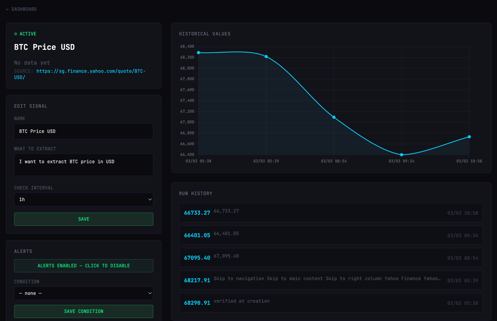

# Signals

Monitor any value on any website — prices, stats, rankings — and get alerted when conditions are met.

Write a prompt in plain English. Signals watches it for you and sends a Telegram message the moment your condition trips.



---

## How it works

1. **Describe** what you want to track ("BTC price on CoinGecko", "PS5 price on Amazon")
2. The agent finds the right URL and figures out how to extract the value
3. Playwright opens the page and takes a screenshot on a schedule
4. Gemini reads the screenshot and extracts the number
5. If the condition is met → Telegram alert + in-app notification

---

## Stack

| Layer | Technology |
|-------|-----------|
| Web framework | FastAPI + Jinja2 + HTMX (server-rendered, no JS framework) |
| Database | MongoDB via Beanie (async ODM) |
| LLM | LiteLLM → Gemini 3.0 Flash (vision + text) |
| Browser | Playwright headless Chromium |
| Scheduler | APScheduler — single catch-up poller every 10 min |
| Package manager | `uv` |

### Architecture

```
Browser (HTMX)
    │
    ▼
FastAPI routes
    │
    ├── /signals/chat     ← LLM chat agent (signal creation)
    ├── /signals/run      ← manual trigger
    ├── /app/alerts       ← triggered alert history
    └── /app/config       ← Telegram credentials + event log
    │
    ├── services/executor.py    ← Playwright screenshot → Gemini vision → value
    ├── services/scheduler.py   ← catch-up poller + condition evaluation
    ├── services/notify.py      ← Telegram delivery
    └── services/tracing.py     ← LiteLLM wrappers + Langfuse observability
    │
MongoDB (Beanie ODM)
    ├── Signal            ← url, query, schedule, condition, next_run_at
    ├── SignalRun         ← per-run record (value, status, timestamp)
    ├── AppConfig         ← Telegram credentials (singleton)
    └── AppEvent          ← scheduler event log
```

---

## Local setup

### Prerequisites

- Python 3.14+
- MongoDB running locally (or set `MONGO_URI`)
- A [Gemini API key](https://aistudio.google.com/app/apikey)
- [`uv`](https://docs.astral.sh/uv/)

### Install

```bash
git clone https://github.com/juanroldanbrz/signals-app.git
cd signals-app

uv sync
uv run playwright install chromium
```

### Configure

```bash
cp .env.example .env
```

Open `.env` and fill in your values:

```env
GEMINI_API_KEY=your_gemini_api_key

# Optional
MONGO_URI=mongodb://localhost:27017
MONGO_DB=signals

# Optional — URL discovery via Brave Search
BRAVE_SEARCH_API_KEY=your_brave_key

# Optional — LLM observability via Langfuse
LANGFUSE_PUBLIC_KEY=
LANGFUSE_SECRET_KEY=
LANGFUSE_HOST=https://cloud.langfuse.com
```

Telegram credentials are configured inside the app at `/app/config` — no restart needed.

### Run

```bash
uv run uvicorn src.main:app --reload
```

Open [http://localhost:8000](http://localhost:8000).

---

## Deploy with Docker

```bash
docker compose up -d
```

The `docker-compose.yml` starts both the app and MongoDB. Make sure your `.env` file is present — it is mounted automatically.

To run just the app against an existing MongoDB:

```bash
docker build -t signals-app .
docker run -p 8000:8000 --env-file .env signals-app
```

---

## Alerts

On any signal's detail page → **ALERTS** panel:

1. Enable alerts with the toggle
2. Choose a condition: `above`, `below`, `equals`, or `any change`
3. Set the threshold (not needed for `any change`)
4. Save — the next scheduled run evaluates the condition

When triggered, alerts appear in `/app/alerts` and (if configured) are sent via Telegram.

---

## LLM providers

Signals uses [LiteLLM](https://docs.litellm.ai) as a gateway, so you can use any supported provider without changing any business logic. Two things need to match: the **model string** in `src/services/tracing.py` and the **API key** in `.env`.

### How to switch

**1. Set the API key in `.env`**

Each provider reads its key from a specific environment variable:

| Provider | `.env` variable | Get a key |
|----------|----------------|-----------|
| Google Gemini *(default)* | `GEMINI_API_KEY` | [aistudio.google.com](https://aistudio.google.com/app/apikey) |
| OpenAI | `OPENAI_API_KEY` | [platform.openai.com](https://platform.openai.com/api-keys) |
| Anthropic | `ANTHROPIC_API_KEY` | [console.anthropic.com](https://console.anthropic.com/) |
| Mistral | `MISTRAL_API_KEY` | [console.mistral.ai](https://console.mistral.ai/) |
| Groq | `GROQ_API_KEY` | [console.groq.com](https://console.groq.com/) |

**2. Update the model string in `src/services/tracing.py`**

Change the `model` default in both `gemini_vision` and `gemini_text`:

```python
# gemini_vision — used to read page screenshots (must support vision)
async def gemini_vision(..., model: str = "openai/gpt-4o") -> str:

# gemini_text — used for the chat agent and signal spec parsing
async def gemini_text(..., model: str = "openai/gpt-4o") -> str:
```

LiteLLM model strings follow the format `provider/model-name`. Examples:

| Provider | Model string | Vision |
|----------|-------------|--------|
| Google Gemini | `gemini/gemini-3.0-flash-preview` *(default)* | yes |
| OpenAI | `openai/gpt-4o` | yes |
| OpenAI | `openai/gpt-4o-mini` | yes |
| Anthropic | `anthropic/claude-opus-4-6` | yes |
| Anthropic | `anthropic/claude-sonnet-4-6` | yes |
| Mistral | `mistral/mistral-small-latest` | no |
| Groq | `groq/llama-3.3-70b-versatile` | no |

> **Vision is required.** Value extraction works by sending a page screenshot to the LLM. Providers or models marked *no* above can still be used for the chat agent (`gemini_text`) but not for extraction (`gemini_vision`).

### Example: switching to OpenAI

`.env`:
```env
OPENAI_API_KEY=sk-...
```

`src/services/tracing.py`:
```python
async def gemini_vision(..., model: str = "openai/gpt-4o") -> str:
async def gemini_text(...,  model: str = "openai/gpt-4o") -> str:
```

No other changes needed.

---

## Tests

```bash
# Unit tests
uv run pytest tests/ -v

# Integration tests (live network)
uv run pytest tests/ -m integration -v
```

---

## License

[MIT](LICENSE) © 2026 Juan Roldan
